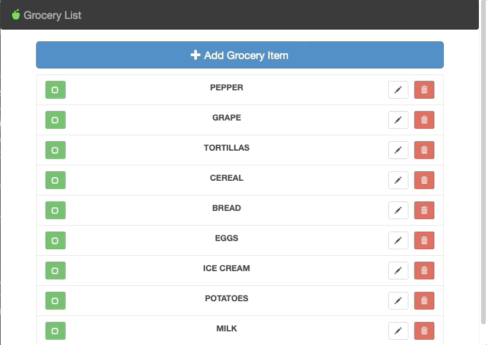
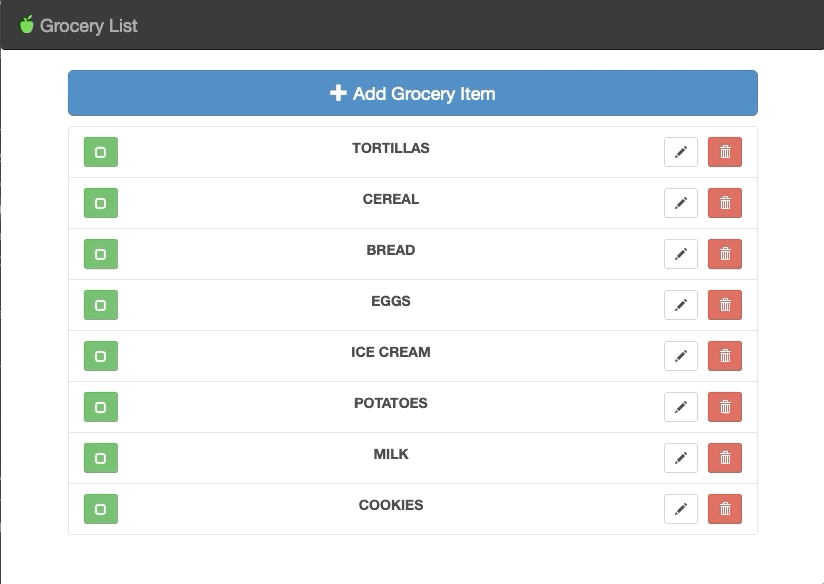

<meta charset="utf-8">
<h1 align="center">Grocery List </h1>

<h2 align="center">

<h2>

 
<h2> ⚙️ Stack </h2>

  - [AngularJS](https://angularjs.org/)
  - [Bootstrap](https://getbootstrap.com/jquer)
  - [JQuery](https://jquery.com/)

 
<h2> 🎯 Purpose </h2>

- Understand AngularJS goals
- Understand and practice the main concepts of the framework by building a grocery list application
- Explore insights of how to apply MVC architecture within the framework 

 
  
<h2> 🛠️ Implementations </h2>

- Add items at the list ✅
  

→ Table displayed using directive <b>ng-repeat</b> at the items in "GroceryService" at app.js

→ Directive <b>ng-model</b> binds the input with the $scope.groceryItems

→ Directive <b>ng-click</b>  check if the input is valid (by using the <b>ng-pattern</b> that accepts regular expressions) and binds with $scope.save at "GroceryListItemController"

→ groceryService.save function get the new id of the item and through <b>push()</b> method add it in the list

--- 
 
 
 

- Delete items ✅

→ Directive <b>ng-click</b> lead to function removeItem() from "HomeController" at app.js

→ Directive <b>ng-model</b> binds with $scope.removeItem at "HomeController"

→ At the function removeItem() at "GroceryService" the method <b>splice()</b> removes the item selected from array

--- 
 
 
 

- Edit items ✅
  

 
→ Directive <b>ng-click</b>  check if the input is valid and binds with $scope.save at "GroceryListItemController"

→ The id that cames from the URL brings all the data associated with the item selected and occurs a verification following the logic at groceryService.findById()

→ <b>clone()</b> method from JQuery present at "GroceryListItemController" makes a clone of the elements and the groceryService.save() ensures that the item will has its attributes modified when saved

--- 
 
   
 

- Check and uncheck items ✅

→ Directive <b>ng-click</b> binds the button with the  $scope.markCompleted at "HomeControler"

→ groceryService.markCompleted() switches the entry state between completed and not(!) completed

→ At the span tag <b>ng-class</b> uses ternary operator to change the view of check or unchecked item base on entry state previously defined
  
---

 
<h2> 🌱 🌳 Contributions </h2>

    1. Make a Fork of this project
    2. Create a branch with the new feature/fix:
       $ git checkout -b your-feature
    3. Create a commit: 
       $ git commit -m 'feat/fix: your feature'
    4. Make the push to the branch
       $ git push origin your-feature
    5. Open a Pull Request

  

This applicaction was developed during the <a target="_blank" href="https://www.udemy.com/share/101xCeBkQfdlZWTXw=/
">AngularJS for Beginners</a> course 👩‍💻 

